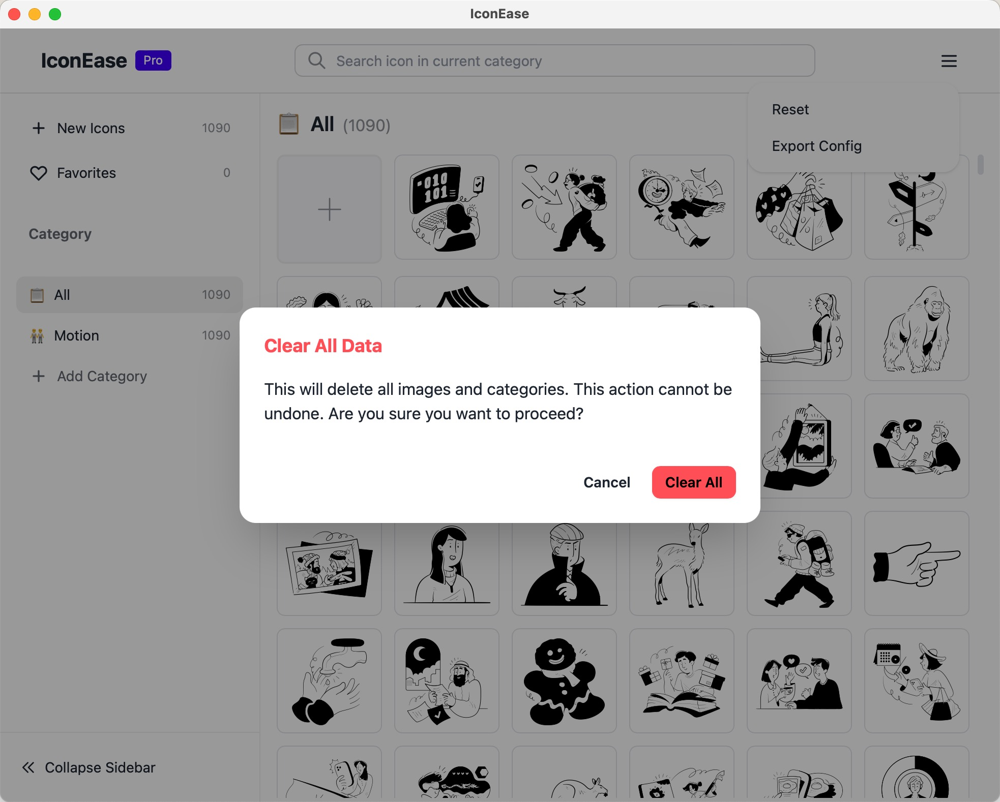

# IconEase

IconEase is a powerful cross-platform desktop application for managing and organizing your image collections. Built with Tauri, React, and TypeScript, it provides a fast, efficient, and user-friendly interface for handling large image libraries.

## Screenshots

<div style="display: flex;" align="center">
  
  <p><em>Main Interface - Light Theme</em></p>
  
  
  <p><em>Category Management with Custom Emoji Icons</em></p>
  
  
  <p><em>Advanced Image Viewer with Zoom Controls</em></p>
  
  
  <p><em>Dark Theme Support</em></p>
</div>

## Features

- 🖼️ **Smart Image Management**: Organize images into customizable categories
- ⚡ **High Performance**: Virtual scrolling for smooth handling of large image collections
- 💾 **Offline First**: All data stored locally using IndexedDB
- 📁 **Folder Import**: Support for importing entire folders of images
- ⭐ **Favorites System**: Mark and filter your favorite images
- 🎯 **Custom Categories**: Create and manage categories with custom emoji icons
- 🖥️ **Cross-Platform**: Works on Windows, macOS, and Linux
- 🌓 **Theme Support**: Light and dark theme options

## Technology Stack

- **Frontend**: React + TypeScript
- **Backend**: Tauri (Rust)
- **State Management**: Zustand
- **Storage**: IndexedDB
- **Styling**: TailwindCSS + DaisyUI

## Development

### Prerequisites

- Node.js (v16 or higher)
- Rust (latest stable)
- Tauri CLI

### Setup

1. Clone the repository:

```bash
git clone https://github.com/yourusername/iconease.git
cd iconease
```

2. Install dependencies:
```bash
npm install
```

3. Run in development mode:
```bash
npm run tauri dev
```

### Building

To create a production build:

```bash
npm run tauri build
```

## License

MIT License - see the [LICENSE](LICENSE) file for details.
