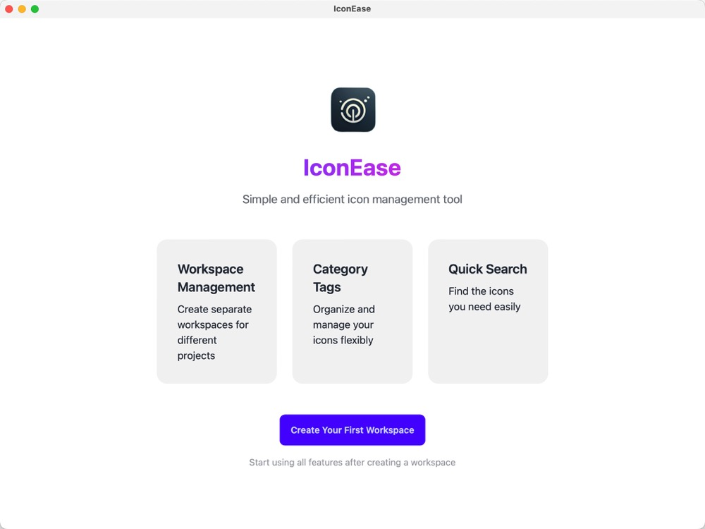
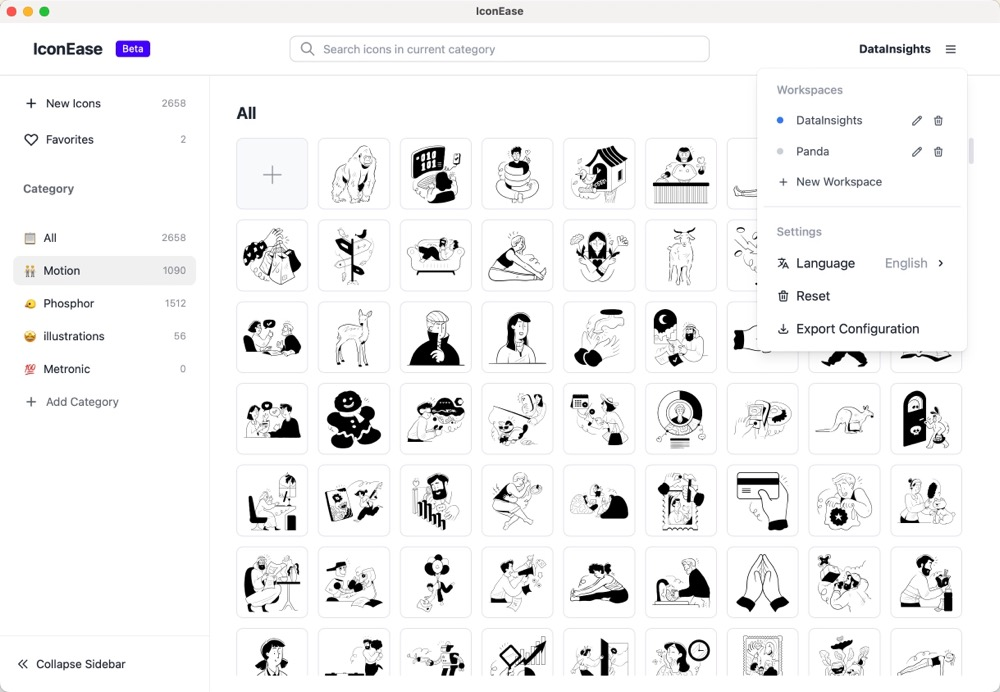

<div align="right">
  <a href="README.md">English</a> | <a href="README.CN.md">简体中文</a>
</div>

<p align="center">
  
</p>

<h1 align="center">IconEase</h1>

<p align="center">
  A modern, efficient desktop application for organizing and managing your icon collections. Perfect for designers, developers, and digital artists who need quick access to their icon libraries.
</p>

## Screenshots

<table>
  <tr>
    <td width="50%">
      
      <p align="center"><em>Muti workspace</em></p>
    </td>
    <td width="50%">
      
      <p align="center"><em>Clear workspace ui</em></p>
    </td>
  </tr>
  <tr>
    <td width="50%">
      
      <p align="center"><em>Intuitive Main Interface</em></p>
    </td>
    <td width="50%">
      
      <p align="center"><em>Smart Category Management</em></p>
    </td>
  </tr>
  <tr>
    <td width="50%">
      
      <p align="center"><em>Advanced Image Viewer</em></p>
    </td>
    <td width="50%">
      
      <p align="center"><em>Clear All Locale Data</em></p>
    </td>
  </tr>
</table>

## Core Features

### 🎯 Smart Organization
- Create custom categories with emoji icons
- Drag & drop folder import
- Bulk import support
- Quick search and filtering
- Favorites system for quick access
- Multiple workspace support for better organization
- Workspace-based data isolation

### ⚡ Performance
- Lightning-fast search
- Smooth scrolling with large collections
- Efficient memory usage with virtual scrolling
- Optimized for SSDs

### 🎨 User Experience
- Clean, modern interface
- Dark/Light themes
- Customizable layout
- Keyboard shortcuts
- Advanced image preview

### 💾 Data Management
- Local storage for privacy
- Auto-backup
- Import/Export functionality
- Cross-platform sync

## Download

Get the latest version for your platform:
- [📥 macOS](https://github.com/JiuRanYa/IconEase/releases/tag/v1.0.1)
- [📥 Linux Support later](https://github.com/yourusername/iconease/releases)
- [📥 Windows Support later](https://github.com/yourusername/iconease/releases)

I have no apple developer id, so when you download this app, skip the mac security certificate:

```
sudo xattr -rd com.apple.quarantine /Applications/IconEase.app
```

## Contributing

We welcome contributions! Whether it's:
- Bug reports
- Feature requests
- Documentation improvements
- Code contributions

Check our [Contributing Guidelines](CONTRIBUTING.md) for more details.

## Privacy

IconEase respects your privacy:
- All data stored locally
- No tracking or analytics
- No internet connection required
- Your icons stay on your device

## License

IconEase is released under the MIT License. See the [LICENSE](https://github.com/JiuRanYa/IconEase/edit/main/LICENSE) file for details.

## Contact

- 💼 GitHub: https://github.com/JiuRanYa

---

<p align="center">Made with ❤️ for designers and developers</p>
